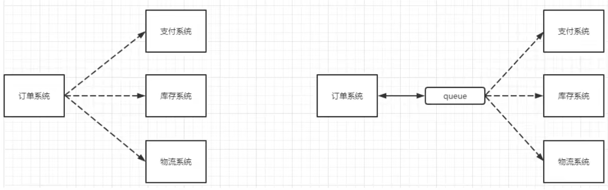
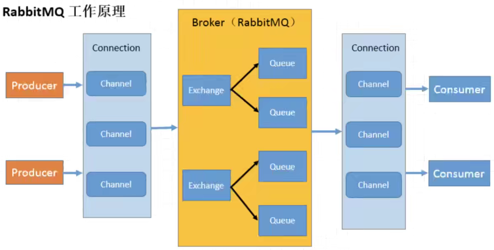

# 消息队列

## MQ的相关概念

### 什么是MQ

MQ(message queue)，从字面意思上看，本质是个队列，FIFO 先入先出，只不过队列中存放的内容是 message 而已，还是一种跨进程的通信机制，用于上下游传递消息。在互联网架构中，MQ 是一种非常常见的上下游“逻辑解耦+物理解耦”的消息通信服务。使用了 MQ 之后，消息发送上游只需要依赖 MQ，不用依赖其他服务。

### 为什么要用MQ

1. **流量削峰**
   
   举个例子，如果订单系统最多能处理一万次订单，这个处理能力应付正常时段的下单时绰绰有余，正常时段我们下单一秒后就能返回结果。但是在高峰期，如果有两万次下单操作系统是处理不了的，只能限制订单超过一万后不允许用户下单。使用消息队列做缓冲，我们可以取消这个限制，把一秒内下的订单分散成一段时间来处理，这时有些用户可能在下单十几秒后才能收到下单成功的操作，但是比不能下单的体验要好。
   
2. **应用解耦**

   以电商应用为例，应用中有订单系统、库存系统、物流系统、支付系统。用户创建订单后，如果耦合调用库存系统、物流系统、支付系统，任何一个子系统出了故障，都会造成下单操作异常。当转变成基于消息队列的方式后，系统间调用的问题会减少很多，比如物流系统因为发生故障，需要几分钟来修复。在这几分钟的时间里，物流系统要处理的内存被缓存在消息队列中，用户的下单操作可以正常完成。当物流系统恢复后，继续处理订单信息即可，中单用户感受不到物流系统的故障，提升系统的可用性。

   

3. **异步处理**

   有些服务间调用是异步的，例如 A 调用 B，B 需要花费很长时间执行，但是 A 需要知道 B 什么时候可以执行完，以前一般有两种方式，A 过一段时间去调用 B的查询 api。或者 A 提供一个callback api，B 执行完之后调用 api 通知 A 服务。这两种方式都不是很优雅，使用消息总线，可以很方便解决这个问题，A 调用 B 服务后，只需要监听 B 处理完成的消息，当 B 处理完成后，会发送一条消息给 MQ，MQ 会将此消息转发给 A 服务。这样 A 服务既不用循环调用 B 的查询 api，也不用提供 callback api。同样 B 服务也不用做这些操作。A 服务还能及时地得到异步处理成功的消息。

### MQ的选择

1. Kafka
   Kafka 主要特点是基于 Pull 的模式来处理消息消费，追求高吞吐量，一开始的目的就是用于日志收集和传输，适合产生**大量数据**的互联网服务的数据收集业务。**大型公司**建议可以选用，如果有**日志采集**功能，肯定是首选 kafka 了。
2. RocketMQ
   天生为金融互联网领域而生，对于可靠性要求很高的场景，尤其是电商里面的订单扣款，以及业务削峰，在大量交易涌入时，后端可能无法及时处理的情况。RocketMQ 在稳定性上可能更值得信赖，这些业务场景在阿里双11已经经历了多次考验，如果你的业务有上述并发场景，建议可以选择 RocketMQ。
3. RabbitMQ
   结合 erlang 语言本身的并发优势，性能好**时效性微秒级**，**社区活跃度也比较高**，管理界面用起来十分方便，如果你的**数据量没有那么大**，中小型公司优先选择功能比较完备的 RabbitMQ。

## RabbitMQ

### 概念

RabbitMQ 是一个消息中间件：它接受并转发消息。你可以把它当做一个快递站点，当你要发送一个包裹时，你把你的包裹放到快递站，快递员最终会把你的快递送到收件人那里，按照这种逻辑 RabbitMQ 是一个快递站，一个快递员帮你传递快件。RabbitMQ 与快递站的主要区别在于，它不处理快件而是接收，存储和转发消息数据。

### 四大核心概念

1. **生产者**：产生数据发送消息的程序是生产者
2. **交换机**：交换机是 RabbitMQ 非常重要的一个部件，一方面它接收来自生产者的消息，另一方面它将消息推送到队列中。交换机必须确切知道如何处理它接收到的消息，是将这些消息推送到特定队列还是推送到多个队列，亦或者是把消息丢弃，这个得由交换机类型决定
3. **队列**：队列是 RabbitMQ 内部使用的一种数据结构，尽管消息流经 RabbitMQ 和应用程序，但它们只能存储在队列中。队列仅受主机的内存和磁盘限制的约束，本质上是一个大的消息缓冲区。许多生产者可以将消息发送到一个队列，许多消费者可以尝试从一个队列接收数据，这就是我们使用队列的方式
4. **消费者**：消费与接收具有相似的含义。消费者大多时候是一个等待接收消息的程序。请注意生产者，消费者和消息中间件很多时候并不在同一机器上。同一个应用程序既可以是生产者又是可以是消费者。

### 各个名词介绍



1. **Broker**：接收和分发消息的应用，RabbitMQ Server 就是 Message Broker
2. **Virtual host**：出于多租户和安全因素设计的，把 AMQP 的基本组件划分到一个虚拟的分组中，类似于网络中的 namespace 概念。当多个不同的用户使用同一个 RabbitMQ server 提供的服务时，可以划分出多个 vhost，每个用户在自己的 vhost 创建 exchange / queue 等
3. **Connection**：publisher / consumer 和 broker 之间的 TCP 连接
4. **Channel**：如果每一次访问 RabbitMQ 都建立一个 Connection，在消息量大的时候建立 TCP Connection 的开销将是巨大的，效率也较低。Channel 是在connection 内部建立的逻辑连接，如果应用程序支持多线程，通常每个 thread 创建单独的 channel 进行通讯，AMQP method 包含了 channel id 帮助客户端和 message broker 识别 channel，所以 channel 之间是完全隔离的。Channel 作为轻量级的 Connection 极大减少了操作系统建立 TCP connection 的开销
5. **Exchange**：message 到达 broker 的第一站，根据分发规则，匹配查询表中的 routing key，分发消息到 queue 中去。常用的类型有：direct (point-to-point), topic (publish-subscribe) and fanout (multicast)
6. **Queue**：消息最终被送到这里等待 consumer 取走
7. **Binding**：exchange 和 queue 之间的虚拟连接，binding 中可以包含 routing key，Binding 信息被保存到 exchange 中的查询表中，用于 message 的分发依据

### 安装

记录一下 Ubuntu 18.04 的安装最新版 Erlang 24.0 和 RabbitMQ 3.9.8 的过程

Ps. 一开始图方便直接 apt-get 安装了旧版的 Erlang 和 RabbitMQ（Ubuntu 的 apt 仓库太旧），到了延迟队列插件环节，发现插件竟然装不上。网上一搜安装新版的方法，清一色 apt-get

#### 安装Erlang 24.0

[https://www.erlang-solutions.com/downloads/](https://www.erlang-solutions.com/downloads/)

```shell
# To add Erlang Solutions repository (including our public key for apt-secure) to your system, call the following commands:
wget https://packages.erlang-solutions.com/erlang-solutions_2.0_all.deb
sudo dpkg -i erlang-solutions_2.0_all.deb

# Next, add the Erlang Solutions public key for "apt-secure" using following commands:
wget https://packages.erlang-solutions.com/ubuntu/erlang_solutions.asc
sudo apt-key add erlang_solutions.asc

# Refresh the repository cache and install either the "erlang" package:
sudo apt-get update
sudo apt-get install erlang
```

#### 安装RabbitMQ 3.9.8

[https://rabbitmq.com/install-debian.html](https://rabbitmq.com/install-debian.html)

使用 dkpg 手动安装

```shell
# sync package metadata
sudo apt-get update
# install dependencies manually
sudo apt-get -y install socat logrotate init-system-helpers adduser

# download the package
sudo apt-get -y install wget
wget https://github.com/rabbitmq/rabbitmq-server/releases/download/v3.9.8/rabbitmq-server_3.9.8-1_all.deb

# install the package with dpkg
sudo dpkg -i rabbitmq-server_3.9.8-1_all.deb
```

访问 GitHub 链接时由于众所周知的原因，如果速度太慢，可以选择本地下载，再传到 Ubuntu

### 常用命令

```shell
# 开机自启动
systemctl enable rabbitmq-server
# 启动服务
systemctl start rabbitmq-server
# 关闭服务
systemctl stop rabbitmq-server
# 查看状态
systemctl status rabbitmq-server
```

### 开启Web界面插件

```shell
# 启用插件
rabbitmq-plugins enable rabbitmq_management
# 添加用户
rabbitmqctl add_user username password
# 设置用户角色
rabbitmqctl set_user_tags username administrator
# 设置用户权限
rabbitmqctl set_permissions -p "/" username ".*" ".*" ".*"
```

如果使用的是云服务器，需要开启防火墙组策略中“5672”和“15672”端口