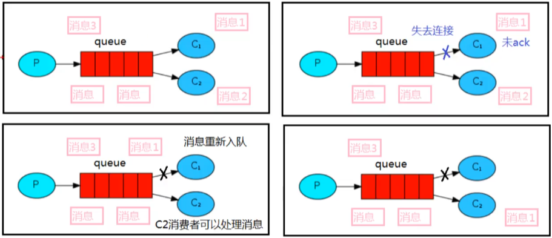

# 消息应答

## 概念

消费者完成一个任务可能需要一段时间，如果其中一个消费者处理一个耗时较长的任务并仅只完成了部分突然它挂掉了，会发生什么情况。RabbitMQ 一旦向消费者传递了一条消息，便立即将该消息标记为删除。在这种情况下，突然有个消费者挂掉了，我们将丢失正在处理的消息，以及后续发送给该消费者的消息，因为它无法接收到。

为了保证消息在发送过程中不丢失，RabbitMQ 引入消息应答机制，消息应答就是：**消费者在接收到消息并且处理该消息之后，告诉 RabbitMQ 它已经处理了，RabbitMQ 可以把该消息删除了。**

## 自动应答

消息发送后立即被认为已经传送成功，这种模式需要**在高吞吐量和数据传输安全性方面做权衡**，因为这种模式如果消息在接收到之前，消费者那边出现连接或者 channel 关闭，那么消息就丢失了，当然另一方面这种模式消费者那边可以传递过载的消息，没有对传递的消息数量进行限制，当然这样有可能使得消费者这边由于接收太多还来不及处理的消息，导致这些消息的积压，最终使得内存耗尽，最终这些消费者线程被操作系统杀死，所以这种模式仅适用在消费者可以高效并以某种速率能够处理这些消息的情况下使用。

## 消息应答的方法

- channel.basicAck()，用于肯定确认，RabbitMQ 已经知道该消息成功被处理，可以将其丢弃了
- channel.basicNack()，用于否定确认
- channel.basicReject()，用于否定确认

## Multiple的解释

手动应答的好处是可以批量应答并且减少网络拥堵

```java
channel.basicAck(deliveryTag, true);//true表示批量应答
```

true 代表批量应答 channel 上未应答的消息，比如当前 channel 上有 tag 为 5,6,7,8 的消息，当前 tag 是8，那么此时 5-8 这些还未应答的消息都会被确认收到消息应答

false 只会应答 tag=8 的消息，5,6,7 这三个消息依然不会被确认收到消息应答

## 消息自动重新入队

如果消费者由于某些原因失去连接（其通道已关闭，连接已关闭或 TCP 连接丢失），导致消息未发送 ACK 确认，RabbitMQ 将了解到消息未完全处理，并将对其重新排队。如果此时其他消费者可以处理，它将很快将其重新分发给另一个消费者。这样，即使某个消费者偶尔死亡，也可以确保不会丢失任何消息。



## 消息手动应答代码

消费者设置手动应答

```java
//设置手动应答
boolean autoAck = false;
channel.basicConsume(QUEUE_NAME, autoAck, deliverCallback, cancelCallback);
```

手动应答

```java
DeliverCallback deliverCallback = (consumerTag, message) -> {
	System.out.println("接收到消息:" + new String(message.getBody()));
	//手动应答
	channel.basicAck(message.getEnvelope().getDeliveryTag(), false);//false不批量应答
};
```

## 手动应答效果

1. 启动第一个消费者开启手动应答，每次接收到消息后 sleep 30秒，`Thread.sleep(30000);`
2. 启动第二个消费者开启手动应答，每次接收到消息后 sleep 1秒，`Thread.sleep(1000);`
3. 启动一个生产者快速发送多个消息
4. 此时消费者1接收到第一个消息并进入 sleep，消费者2每秒接收一个消息
5. 结束消费者1的进程，消费者1尚未处理完的消息将重新入队，并排在队头，并被消费者2重新消费
