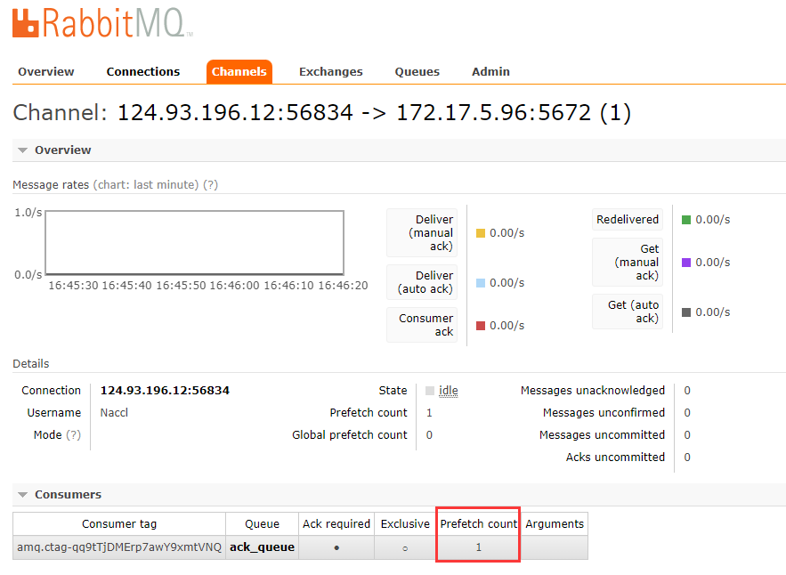

# 不公平分发

在最开始的时候我们学习到 RabbitMQ 分发消息采用的轮训分发，但是在某种场景下这种策略并不是很好，比方说有两个消费者在处理任务，其中有个消费者1处理任务的速度非常快，而另外一个消费者2处理速度却很慢，这个时候我们还是采用轮训分发的话就会到这处理速度快的这个消费者很大一部分时间处于空闲状态，而处理慢的那个消费者一直在干活，这种分配方式在这种情况下其实就不太好，但是 RabbitMQ 并不知道这种情况，它依然很公平的进行分发。

为了避免这种情况，可以在**消费者代码中**设置参数`channel.basicQos(1);`

```java
int prefetchCount = 1;
channel.basicQos(prefetchCount);
```



意思就是如果这个任务我还没有处理完或者我还没有应答你，你先别分配给我，我目前只能处理一个任务，然后 RabbitMQ 就会把该任务分配给没有那么忙的那个空闲消费者，当然如果所有的消费者都没有完成手上任务，队列还在不停的添加新任务，队列有可能就会遇到队列被撑满的情况，这个时候就只能添加新的 worker 或者改变其他存储任务的策略。

## 预取值

简单来说就是限制**通道上允许接收未确认消息的最大数量**

比如：

消费者1

```java
int prefetchCount = 2;
channel.basicQos(prefetchCount);
```

消费者2

```java
int prefetchCount = 5;
channel.basicQos(prefetchCount);
```

那么 MQ 给消费者1传递2条消息，给消费者2传递5条消息后，就会停止传递。直到消费者确认消息后，才会再次在通道上传递消息。