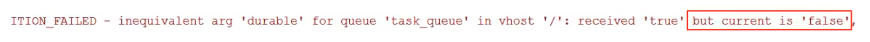
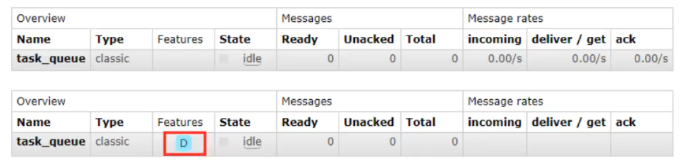

# 持久化

## 概念

默认情况下 RabbitMQ 退出或由于某种原因崩溃时，它忽视队列和消息（队列和消息都将丢失）。确保消息不会丢失需要做两件事：**将队列和消息都标记为持久化**。

## 队列如何实现持久化

在声明队列时把 `durable`参数设置为持久化

```java
boolean durable = true;
channel.queueDeclare(QUEUE_NAME, durable, false, false, null);
```

如果之前声明的队列不是持久化的，需要把原先队列先删除，或者重新创建一个持久化的队列，否则就会报错



以下为控制台中持久化与非持久化队列的 UI 显示区：



这个时候即使重启 RabbitMQ 队列也依然存在

## 消息如何实现持久化

要想让消息实现持久化需要在消息生产者修改代码，`MessageProperties.PERSISTENT_TEXT_PLAIN`添加这个属性。

```java
channel.basicPublish("", QUEUE_NAME, MessageProperties.PERSISTENT_TEXT_PLAIN, msg.getBytes());
```

将消息标记为持久化并不能完全保证不会丢失消息。尽管它告诉 RabbitMQ 将消息保存到磁盘，但是这里依然存在当消息刚准备存储在磁盘的时候但是还没有存储完，消息还在缓存的一个间隔点。此时并没有真正写入磁盘。持久性保证并不强，但是对于我们的简单任务队列而言，这已经绰绰有余了。如果需要更强有力的持久化策略，需要进行发布确认。
