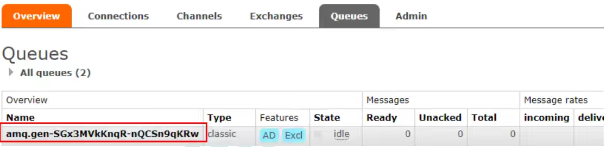
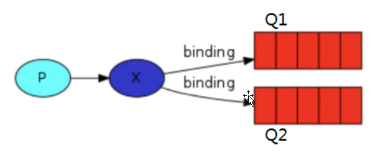
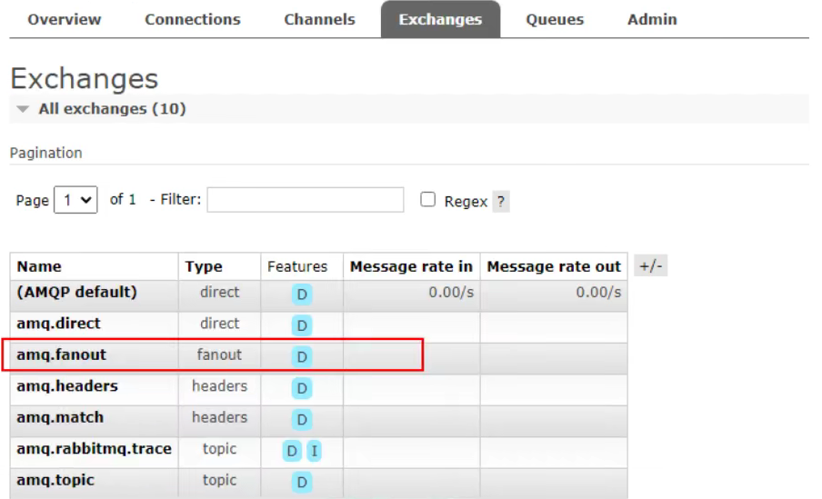
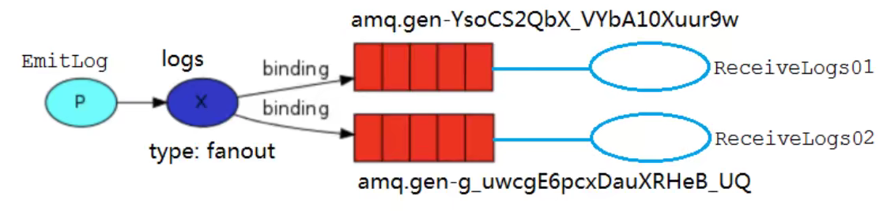
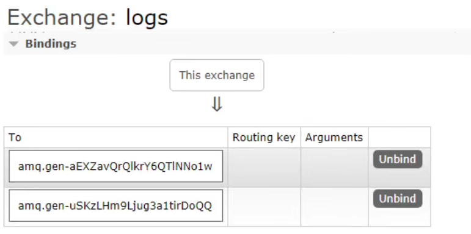
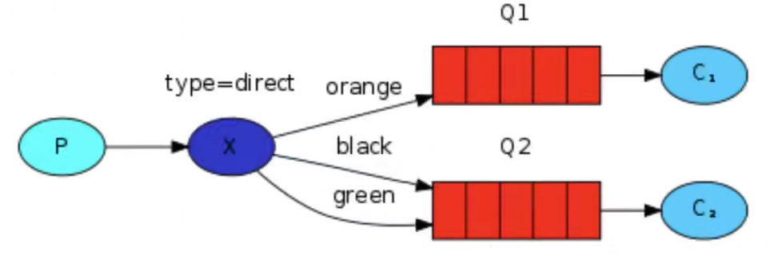
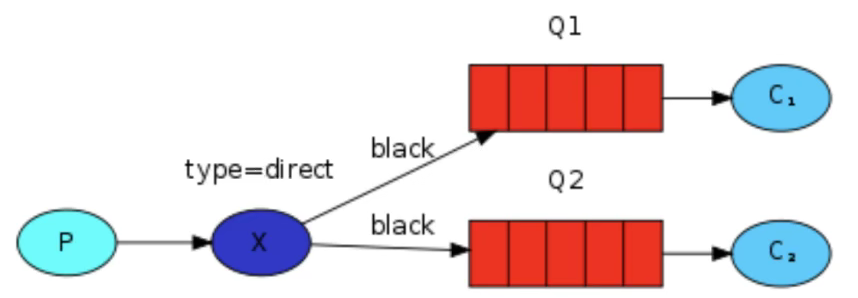
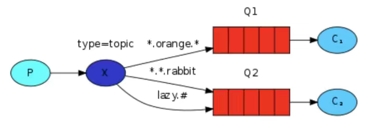
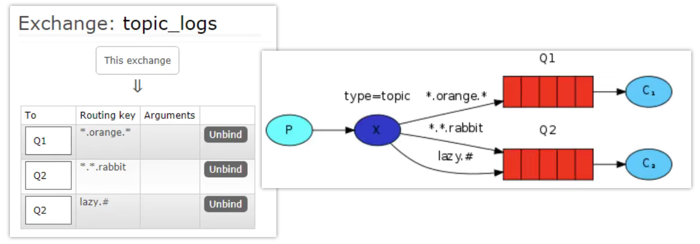

# 交换机

在之前我们创建的是工作队列，我们假设的是工作队列背后，每个任务都恰好交付给一个消费者(工作进程)。在这一部分中，我们将做一些完全不同的事情：我们将消息传达给多个消费者。这种模式称为“发布/订阅”。

为了说明这种模式，我们将构建一个简单的日志系统。它将由两个程序组成：第一个程序将发出日志消息，第二个程序是消费者。其中我们会启动两个消费者，事实上第一个程序发出的日志消息将广播给所有消费者。

## Exchanges

### 概念

RabbitMQ 消息传递模型的核心思想是：**生产者生产的消息从不会直接发送到队列**。实际上，通常生产者甚至都不知道这些消息传递到了哪些队列中。

相反，**生产者只能将消息发送到交换机(exchange)**，交换机工作的内容非常简单，一方面它接收来自生产者的消息，另一方面将它们推入队列。交换机必须确切知道如何处理收到的消息。是应该把这些消息放到特定队列还是说把他们放到许多队列中还是说应该丢弃它们。这就由交换机的类型来决定。

### 类型

总共有以下类型：

- 直接（direct）
- 主题（topic）
- 标题（headers）
- 扇出（fanout）

### 无名exchange

在前面我们对 exchange 一无所知，但仍然能够将消息发送到队列。之前能实现的原因是因为我们使用的是默认交换，我们通过空字符串进行标识。

```java
channel.basicPublish("", queueName, null, msg.getBytes());
```

第一个参数是交换机的名称。空字符串表示默认或无名称交换机：消息能路由发送到队列中其实是由 `routingKey(bindingkey)` 绑定 key 指定的，如果它存在的话。

## 临时队列

之前我们使用的是具有特定名称的队列。队列的名称我们来说至关重要：我们需要指定我们的消费者去消费哪个队列的消息。

每当我们连接到 RabbitMQ 时，我们都需要一个全新的空队列，为此我们可以创建一个具有**随机名称的队列**，或者能让服务器为我们选择一个随机队列名称那就更好了。其次**一旦我们断开了消费者的连接，队列将被自动删除**。

创建临时队列的方式如下：

```java
String queueName = channel.queueDeclare().getQueue();
```

创建出来之后长成这样：



## 绑定（bingdings）

binding 其实是 exchange 和 queue 之间的桥梁，它告诉我们 exchange 和哪个队列进行了绑定关系。比如说下面这张图告诉我们的就是 X 与 Q1 和 Q2 进行了绑定：



## Fanout

### 介绍

Fanout 这种类型非常简单。它是将接收到的所有消息广播到它知道的所有队列中。系统中默认有些 exchange 类型：



### 实战



Logs 和临时队列的绑定关系如下图：



ReceiveLogs01 和 ReceiveLogs02 将接收到的消息打印在控制台：

```java
public class ReceiveLogs01 {
	public static final String EXCHANGE_NAME = "logs";

	public static void main(String[] args) throws IOException {
		Channel channel = RabbitMqUtils.getChannel();
		//声明一个队列
		/**
		 * 生成一个临时队列，队列的名称是随机的
		 * 当消费者断开与队列的连接时，队列自动删除
		 */
		String queueName = channel.queueDeclare().getQueue();
		//绑定交换机与队列
		channel.queueBind(queueName, EXCHANGE_NAME, "1");
		System.out.println("等待接收消息，把接收到的消息打印在屏幕上......");

		//接收消息
		DeliverCallback deliverCallback = (consumerTag, message) -> {
			System.out.println("ReceiveLogs01 打印消息:" + new String(message.getBody()));
		};

		//消费者取消消费时回调接口
		CancelCallback cancelCallback = consumerTag -> {
			System.out.println(consumerTag + "消费者取消消费接口回调逻辑");
		};

		channel.basicConsume(queueName, true, deliverCallback, cancelCallback);
	}
}
```

EmitLog 发送消息给两个消费者：

```java
public class EmitLog {
	public static final String EXCHANGE_NAME = "logs";

	public static void main(String[] args) throws IOException {
		Channel channel = RabbitMqUtils.getChannel();
		//声明一个交换机
		channel.exchangeDeclare(EXCHANGE_NAME, BuiltinExchangeType.FANOUT);

		Scanner scanner = new Scanner(System.in);
		while (scanner.hasNext()) {
			String msg = scanner.next();
			channel.basicPublish(EXCHANGE_NAME, "", null, msg.getBytes());
			System.out.println("生产者发出消息：" + msg);
		}
	}
}
```

结果：当 EmitLog 发出消息时，向绑定到交换机上的所有队列传递消息，即使`routingKey`不同，也都能接收到相同的消息。

## Direct exchange

### 介绍

direct 这种类型的工作方式是，消息只去到它绑定的 routingKey 队列中去。



在上面这张图中，我们可以看到 X 绑定了两个队列，绑定类型是direct。队列 Q1 路由键为 orange，队列 Q2 路由键有两个：一个路由键为 black，另一个路由键为 green。

在这种绑定情况下，生产者发布消息到 exchange 上，路由键为 orange 的消息会被发布到队列Q1。路由键为 black 和 green 的消息会被发布到队列 Q2，其他消息类型的消息将被丢弃。

### 多重绑定



当然如果 exchange 的绑定类型是 direct，但是它绑定的多个队列的 key 如果都相同，在这种情况下虽然绑定类型是 direct 但是它表现的就和 fanout 有点类似了，就跟广播差不多，如上图所示。

### 实战

生产者：

```java
public class DirectLogs {
	public static final String EXCHANGE_NAME = "direct_logs";
	public static final String ROUTING_KEY_INFO = "info";
	public static final String ROUTING_KEY_WARNING = "warning";
	public static final String ROUTING_KEY_ERROR = "error";

	public static void main(String[] args) throws IOException {
		Channel channel = RabbitMqUtils.getChannel();
		//声明一个交换机
		channel.exchangeDeclare(EXCHANGE_NAME, BuiltinExchangeType.DIRECT);

		Scanner scanner = new Scanner(System.in);
		while (scanner.hasNext()) {
			String msg = scanner.next();
			channel.basicPublish(EXCHANGE_NAME, ROUTING_KEY_INFO, null, msg.getBytes());
			System.out.println("生产者发出消息：" + msg);
		}
	}
}
```

消费者1：

```java
public class ReceiveLogsDirect01 {
	public static final String EXCHANGE_NAME = "direct_logs";
	public static final String QUEUE_NAME = "console";
	public static final String ROUTING_KEY_INFO = "info";
	public static final String ROUTING_KEY_WARNING = "warning";

	public static void main(String[] args) throws IOException {
		Channel channel = RabbitMqUtils.getChannel();
		//声明一个队列
		channel.queueDeclare(QUEUE_NAME, false, false, false, null);
		//绑定两个routingKey
		channel.queueBind(QUEUE_NAME, EXCHANGE_NAME, ROUTING_KEY_INFO);
		channel.queueBind(QUEUE_NAME, EXCHANGE_NAME, ROUTING_KEY_WARNING);

		//接收消息
		DeliverCallback deliverCallback = (consumerTag, message) -> {
			System.out.println("ReceiveLogsDirect01 打印消息:" + new String(message.getBody()));
		};

		//消费者取消消费时回调接口
		CancelCallback cancelCallback = consumerTag -> {
			System.out.println(consumerTag + "消费者取消消费接口回调逻辑");
		};

		channel.basicConsume(QUEUE_NAME, true, deliverCallback, cancelCallback);
	}
}
```

消费者2（绑定的 routingKey 不同）：

```java
public class ReceiveLogsDirect02 {
	public static final String EXCHANGE_NAME = "direct_logs";
	public static final String QUEUE_NAME = "disk";
	public static final String ROUTING_KEY_ERROR = "error";

	public static void main(String[] args) throws IOException {
		Channel channel = RabbitMqUtils.getChannel();
		//声明一个队列
		channel.queueDeclare(QUEUE_NAME, false, false, false, null);
		//绑定一个routingKey
		channel.queueBind(QUEUE_NAME, EXCHANGE_NAME, ROUTING_KEY_ERROR);

		//接收消息
		DeliverCallback deliverCallback = (consumerTag, message) -> {
			System.out.println("ReceiveLogsDirect02 打印消息:" + new String(message.getBody()));
		};

		//消费者取消消费时回调接口
		CancelCallback cancelCallback = consumerTag -> {
			System.out.println(consumerTag + "消费者取消消费接口回调逻辑");
		};

		channel.basicConsume(QUEUE_NAME, true, deliverCallback, cancelCallback);
	}
}
```

结果：

- 生产者向`ROUTING_KEY_INFO`发送消息时，消费者1可以收到消息
- 生产者向`ROUTING_KEY_WARNING`发送消息时，消费者1可以收到消息
- 生产者向`ROUTING_KEY_ERROR`发送消息时，消费者2可以收到消息
- 如果启动多个消费者1，生产者向`ROUTING_KEY_INFO`或`ROUTING_KEY_WARNING`发送消息时，多个消费者1将会轮流公平接收消息，且每个消息只会被消费一次。

## Topic

### 要求

发送到类型是 topic 交换机的消息的 routing_key 不能随意写，必须满足一定的要求，**它必须是一个单词列表，以点号分隔开**。这些单词可以是任意单词，比如："stock.usd.nyse", "nyse.vmw", "quick.orange.rabbit"。当然这个单词列表最多不能超过255个字节。

在这个规则列表中，其中有两个替换符：

- \*(星号)可以代替一个单词
- \#(井号)可以替代零个或多个单词

### 匹配案例

下图绑定关系如下

Q1 绑定的是：中间带 orange 带3个单词的字符串(\*.orange.\*)
Q2 绑定的是：最后一个单词是 rabbit 的3个单词(\*.\*.rabbit)、第一个单词是 lazy 的多个单词(lazy.#)



上图是一个队列绑定关系图，我们来看看他们之间数据接收情况是怎么样的

- quick.orange.rabbit 被队列 Q1 Q2 接收到
- lazy.orange.elephant 被队列 Q1 Q2 接收到
- quick.orange.fox 被队列 Q1 接收到
- lazy.brown.fox 被队列 Q2 接收到
- lazy.pink.rabbit 虽然满足两个绑定但只被队列 Q2 接收一次
- quick.brown.fox 不匹配任何绑定不会被任何队列接收到会被丢弃
- quick.orange.male.rabbit 是四个单词不匹配任何绑定会被丢弃
- lazy.orange.male.rabbit 是四个单词但匹配 Q2

当队列绑定关系是下列这种情况时需要引起注意：

- 当一个队列绑定键是 #，那么这个队列将接收所有数据，就有点像 fanout 了
- 如果队列绑定键当中没有 # 和 * 出现，那么该队列绑定类型就是 direct 了

### 实战



消费者1：

```java
public class ReceiveLogsTopic01 {
	public static final String EXCHANGE_NAME = "topic_logs";
	public static final String QUEUE_NAME = "Q1";
	public static final String ROUTING_KEY = "*.orange.*";

	public static void main(String[] args) throws IOException {
		Channel channel = RabbitMqUtils.getChannel();
		//声明一个交换机
		channel.exchangeDeclare(EXCHANGE_NAME, BuiltinExchangeType.TOPIC);
		//声明一个队列
		channel.queueDeclare(QUEUE_NAME, false, false, false, null);
		//绑定一个routingKey
		channel.queueBind(QUEUE_NAME, EXCHANGE_NAME, ROUTING_KEY);
		System.out.println("等待接收消息......");

		//接收消息
		DeliverCallback deliverCallback = (consumerTag, message) -> {
			System.out.println("queue:" + QUEUE_NAME + ", routingKey:" + message.getEnvelope().getRoutingKey() + ", msg:" + new String(message.getBody()));
		};

		//消费者取消消费时回调接口
		CancelCallback cancelCallback = consumerTag -> {
			System.out.println(consumerTag + "消费者取消消费接口回调逻辑");
		};

		channel.basicConsume(QUEUE_NAME, true, deliverCallback, cancelCallback);
	}
}
```

消费者2：

```java
public class ReceiveLogsTopic02 {
	public static final String EXCHANGE_NAME = "topic_logs";
	public static final String QUEUE_NAME = "Q2";
	public static final String ROUTING_KEY1 = "*.*.rabbit";
	public static final String ROUTING_KEY2 = "lazy.#";

	public static void main(String[] args) throws IOException {
		Channel channel = RabbitMqUtils.getChannel();
		//声明一个交换机
		channel.exchangeDeclare(EXCHANGE_NAME, BuiltinExchangeType.TOPIC);
		//声明一个队列
		channel.queueDeclare(QUEUE_NAME, false, false, false, null);
		//绑定一个routingKey
		channel.queueBind(QUEUE_NAME, EXCHANGE_NAME, ROUTING_KEY1);
		channel.queueBind(QUEUE_NAME, EXCHANGE_NAME, ROUTING_KEY2);
		System.out.println("等待接收消息......");

		//接收消息
		DeliverCallback deliverCallback = (consumerTag, message) -> {
			System.out.println("queue:" + QUEUE_NAME + ", routingKey:" + message.getEnvelope().getRoutingKey() + ", msg:" + new String(message.getBody()));
		};

		//消费者取消消费时回调接口
		CancelCallback cancelCallback = consumerTag -> {
			System.out.println(consumerTag + "消费者取消消费接口回调逻辑");
		};

		channel.basicConsume(QUEUE_NAME, true, deliverCallback, cancelCallback);
	}
}
```

生产者：

```java
public class EmitLogTopic {
	public static final String EXCHANGE_NAME = "topic_logs";

	public static void main(String[] args) throws IOException {
		Channel channel = RabbitMqUtils.getChannel();

		Map<String, String> bindingKeyMap = new LinkedHashMap<>();
		bindingKeyMap.put("quick.orange.rabbit", "被队列 Q1 Q2 接收到");
		bindingKeyMap.put("lazy.orange.elephant", "被队列 Q1 Q2 接收到");
		bindingKeyMap.put("quick.orange.fox", "被队列 Q1 接收到");
		bindingKeyMap.put("lazy.brown.fox", "被队列 Q2 接收到");
		bindingKeyMap.put("lazy.pink.rabbit", "虽然满足两个绑定但只被队列 Q2 接收一次");
		bindingKeyMap.put("quick.brown.fox", "不匹配任何绑定不会被任何队列接收到会被丢弃");
		bindingKeyMap.put("quick.orange.male.rabbit", "是四个单词不匹配任何绑定会被丢弃");
		bindingKeyMap.put("lazy.orange.male.rabbit", "是四个单词但匹配 Q2");

		bindingKeyMap.forEach((k, v) -> {
			try {
				channel.basicPublish(EXCHANGE_NAME, k, null, v.getBytes());
			} catch (IOException e) {
				e.printStackTrace();
			}
			System.out.println(k + v);
		});

	}
}
```

结果：

```java
---------------------
EmitLogTopic:
---------------------
quick.orange.rabbit被队列 Q1 Q2 接收到
lazy.orange.elephant被队列 Q1 Q2 接收到
quick.orange.fox被队列 Q1 接收到
lazy.brown.fox被队列 Q2 接收到
lazy.pink.rabbit虽然满足两个绑定但只被队列 Q2 接收一次
quick.brown.fox不匹配任何绑定不会被任何队列接收到会被丢弃
quick.orange.male.rabbit是四个单词不匹配任何绑定会被丢弃
lazy.orange.male.rabbit是四个单词但匹配 Q2
---------------------
ReceiveLogsTopic01:
---------------------
等待接收消息......
queue:Q1, routingKey:quick.orange.rabbit, msg:被队列 Q1 Q2 接收到
queue:Q1, routingKey:lazy.orange.elephant, msg:被队列 Q1 Q2 接收到
queue:Q1, routingKey:quick.orange.fox, msg:被队列 Q1 接收到
---------------------
ReceiveLogsTopic02:
---------------------
等待接收消息......
queue:Q2, routingKey:quick.orange.rabbit, msg:被队列 Q1 Q2 接收到
queue:Q2, routingKey:lazy.orange.elephant, msg:被队列 Q1 Q2 接收到
queue:Q2, routingKey:lazy.brown.fox, msg:被队列 Q2 接收到
queue:Q2, routingKey:lazy.pink.rabbit, msg:虽然满足两个绑定但只被队列 Q2 接收一次
queue:Q2, routingKey:lazy.orange.male.rabbit, msg:是四个单词但匹配 Q2
```

