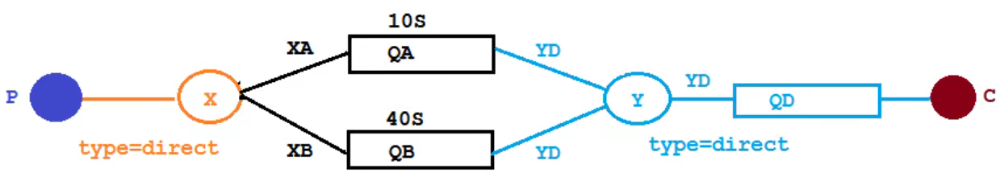
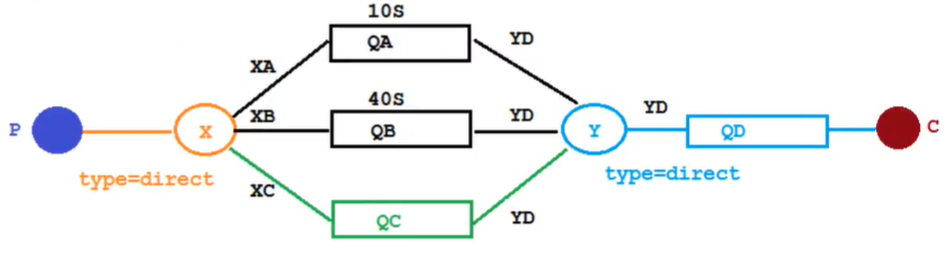
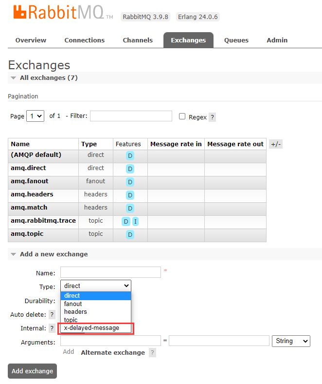
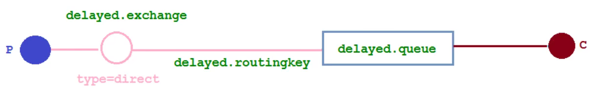

# 延迟队列

## 概念

延迟队列，队列内部是有序的，最重要的特性就体现在它的延时属性上，延迟队列中的元素是希望在指定时间到了以后或之前取出和处理，简单来说，延迟队列就是用来存放需要在指定时间被处理的元素的队列。

## 使用场景

1. 订单在十分钟之内未支付则自动取消
2. 新创建的店铺，如果在十天内都没有上传过商品，则自动发送消息提醒
3. 用户注册成功后，如果三天内没有登陆则进行短信提醒

这些场景都有一个特点，需要在某个事件发生之后或者之前的指定时间点完成某一项任务，如：发生订单生成事件，在十分钟之后检查该订单支付状态，然后将未支付的订单进行关闭。看起来似乎使用定时任务，一直轮询数据，每秒查一次，取出需要被处理的数据，然后处理不就完事了吗？如果数据量比较少，确实可以这样做，比如：对于“如果账单一周内未支付则进行自动结算”这样的需求，如果对于时间不是严格限制，而是宽松意义上的一周，那么每天晚上跑个定时任务检查一下所有未支付的账单，确实也是一个可行的方案。但对于数据量比较大，并且时效性较强的场景，如：“订单十分钟内未支付则关闭“，短期内未支付的订单数据可能会有很多，活动期间甚至会达到百万甚至千万级别，对这么庞大的数据量仍旧使用轮询的方式显然是不可取的，很可能在一秒内无法完成所有订单的检查，同时会给数据库带来很大压力，无法满足业务要求而且性能低下。

## 两种设置消息TTL的方式

1. 在声明队列时，设置队列属性中消息过期时间

```java
Map<String, Object> arguments = new HashMap<>();
arguments.put("x-message-ttl", 10000);
channel.queueDeclare(NORMAL_QUEUE, false, false, false, arguments);
```

2. 在发布消息时，设置消息本身的过期时间

```java
AMQP.BasicProperties basicProperties = new AMQP.BasicProperties().builder().expiration("10000").build();
channel.basicPublish(NORMAL_EXCHANGE, NORMAL_ROUTING_KEY, basicProperties, msg.getBytes());
```

**两种方式的区别：**

1. 设置队列属性， 那么队列中所有的消息都有相同的过期时间，如果消息过期，则会直接从队列中丢弃，原因是，由于 TTL 一致， 又是 FIFO 的模式，那么过期消息一定在队列的头部
2. 对于消息本身设置 TTL，如果消息过期，不会马上丢弃，而是在消息进行投递的时候检查过期再丢弃，这样1. 简单，维护成本低 2. 性能更好，不用实时扫描队列

## 队列TTL-整合Spring Boot

### 代码结构图

创建两个队列 QA 和 QB，两者队列 TTL 分别设置为 10s 和 40s，然后再创建一个交换机 X 和死信交换机 Y，它们的类型都是 direct，创建一个死信队列 QD，它们的绑定关系如下：



### 代码

声明交换机和队列：

```java
@Configuration
public class TtlQueueConfig {
	//普通交换机名称
	public static final String EXCHANGE_X = "X";
	//死信交换机名称
	public static final String DEAD_LETTER_EXCHANGE_Y = "Y";
	//普通队列名称
	public static final String QUEUE_A = "QA";
	public static final String QUEUE_B = "QB";
	//死信队列名称
	public static final String DEAD_LETTER_QUEUE_D = "QD";
	//普通队列A routingKey
	public static final String QUEUE_A_ROUTING_KEY = "XA";
	//普通队列B routingKey
	public static final String QUEUE_B_ROUTING_KEY = "XB";
	//死信队列D routingKey
	public static final String DEAD_LETTER_QUEUE_D_ROUTING_KEY = "YD";

	/**
	 * 声明交换机X
	 */
	@Bean("exchangeX")
	public DirectExchange exchangeX() {
		return new DirectExchange(EXCHANGE_X);
	}

	/**
	 * 声明交换机Y
	 */
	@Bean("exchangeY")
	public DirectExchange exchangeY() {
		return new DirectExchange(DEAD_LETTER_EXCHANGE_Y);
	}

	/**
	 * 声明普通队列QA TTL为10s
	 */
	@Bean("queueA")
	public Queue queueA() {
		Map<String, Object> arguments = new HashMap<>();
		//设置死信交换机
		arguments.put("x-dead-letter-exchange", DEAD_LETTER_EXCHANGE_Y);
		//设置死信routingKey
		arguments.put("x-dead-letter-routing-key", DEAD_LETTER_QUEUE_D_ROUTING_KEY);
		//设置TTL 单位ms
		arguments.put("x-message-ttl", 10000);
		return QueueBuilder.durable(QUEUE_A).withArguments(arguments).build();
	}

	/**
	 * 声明普通队列QB TTL为40s
	 */
	@Bean("queueB")
	public Queue queueB() {
		Map<String, Object> arguments = new HashMap<>();
		//设置死信交换机
		arguments.put("x-dead-letter-exchange", DEAD_LETTER_EXCHANGE_Y);
		//设置死信routingKey
		arguments.put("x-dead-letter-routing-key", DEAD_LETTER_QUEUE_D_ROUTING_KEY);
		//设置TTL 单位ms
		arguments.put("x-message-ttl", 40000);
		return QueueBuilder.durable(QUEUE_B).withArguments(arguments).build();
	}

	/**
	 * 声明死信队列
	 */
	@Bean("queueD")
	public Queue queueD() {
		return QueueBuilder.durable(DEAD_LETTER_QUEUE_D).build();
	}

	/**
	 * 绑定QA和X
	 */
	@Bean
	public Binding queueABindingX(@Qualifier("queueA") Queue queueA, @Qualifier("exchangeX") DirectExchange exchangeX) {
		return BindingBuilder.bind(queueA).to(exchangeX).with(QUEUE_A_ROUTING_KEY);
	}

	/**
	 * 绑定QB和X
	 */
	@Bean
	public Binding queueBBindingX(@Qualifier("queueB") Queue queueB, @Qualifier("exchangeX") DirectExchange exchangeX) {
		return BindingBuilder.bind(queueB).to(exchangeX).with(QUEUE_B_ROUTING_KEY);
	}

	/**
	 * 绑定QD和Y
	 */
	@Bean
	public Binding queueDBindingY(@Qualifier("queueD") Queue queueD, @Qualifier("exchangeY") DirectExchange exchangeY) {
		return BindingBuilder.bind(queueD).to(exchangeY).with(DEAD_LETTER_QUEUE_D_ROUTING_KEY);
	}
}
```

生产者：

```java
@Slf4j
@RestController
@RequestMapping("/ttl")
public class SendMsgController {
	@Autowired
	private RabbitTemplate rabbitTemplate;

	@GetMapping("/sendMsg/{message}")
	public void sendMsg(@PathVariable String message) {
		log.info("当前时间:{}, 发送一条消息给两个TTL队列:{}", LocalDateTime.now(), message);
		rabbitTemplate.convertAndSend(TtlQueueConfig.EXCHANGE_X, TtlQueueConfig.QUEUE_A_ROUTING_KEY, "消息来自TTL为10s的队列:" + message);
		rabbitTemplate.convertAndSend(TtlQueueConfig.EXCHANGE_X, TtlQueueConfig.QUEUE_B_ROUTING_KEY, "消息来自TTL为40s的队列:" + message);
	}
}
```

死信队列消费者：

```java
@Slf4j
@Component
public class DeadLetterQueueConsumer {
	@RabbitListener(queues = TtlQueueConfig.DEAD_LETTER_QUEUE_D)
	public void receiveD(Message message, Channel channel) {
		String msg = new String(message.getBody());
		log.info("当前时间:{}, 收到死信队列的消息:{}", LocalDateTime.now(), msg);
	}
}
```

**第一条消息在 10s 后变成了死信消息，然后被消费者消费掉，第二条消息在 40s 之后变成了死信消息，然后被消费掉，这样一个延迟队列就打造完成了。**

## 延迟队列优化

不过，如果这样使用的话，岂不是每增加一个新的时间需求，就要新增一个队列，这里只有 10s 和 40s 两个时间选项，如果需要一个小时后处理，那么就需要增加 TTL 为一个小时的队列，如果是预定会议室然后提前通知这样的场景，岂不是要增加无数个队列才能满足需求？

### 代码结构图

在这里新增了一个队列 QC，绑定关系如下，该队列不设置 TTL 时间，而是在生产者发送消息时设置消息 TTL



### 代码

声明队列 QC：

```java
public static final String QUEUE_C = "QC";
public static final String QUEUE_C_ROUTING_KEY = "XC";
/**
 * 声明普通队列QC 不设置TTL
 */
@Bean("queueC")
public Queue queueC() {
	Map<String, Object> arguments = new HashMap<>();
	//设置死信交换机
	arguments.put("x-dead-letter-exchange", DEAD_LETTER_EXCHANGE_Y);
	//设置死信routingKey
	arguments.put("x-dead-letter-routing-key", DEAD_LETTER_QUEUE_D_ROUTING_KEY);
	return QueueBuilder.durable(QUEUE_C).withArguments(arguments).build();
}
/**
 * 绑定QC和X
 */
@Bean
public Binding queueCBindingX(@Qualifier("queueC") Queue queueC, @Qualifier("exchangeX") DirectExchange exchangeX) {
	return BindingBuilder.bind(queueC).to(exchangeX).with(QUEUE_C_ROUTING_KEY);
}
```

生产者：

```java
@GetMapping("/sendExpirationMsg/{message}/{ttlTime}")
public void sendMsg(@PathVariable String message, @PathVariable String ttlTime) {
	log.info("当前时间:{}, 发送一条TTL为{}ms的消息给队列QC:{}", LocalDateTime.now(), ttlTime, message);
	rabbitTemplate.convertAndSend(TtlQueueConfig.EXCHANGE_X, TtlQueueConfig.QUEUE_C_ROUTING_KEY, message, msg -> {
		//设置消息TTL
		msg.getMessageProperties().setExpiration(ttlTime);
		return msg;
	});
}
```

**看起来似乎没什么问题，但是在[两种设置消息TTL的方式](#两种设置消息TTL的方式)，介绍过如果使用在消息属性上设置 TTL 的方式，消息可能并不会按时进入死信队列，因为 RabbitMQ 只会检查队列中第一个消息是否过期，如果过期则丢到死信队列，如果第一个消息的延时时长很长，而第二个消息的延时时长很短，第二个消息并不会优先得到执行。**

## 插件实现延迟队列

下载 RabbitMQ 延迟队列插件 [rabbitmq-delayed-message-exchange](https://github.com/rabbitmq/rabbitmq-delayed-message-exchange)，并拷贝至`/usr/lib/rabbitmq/lib/rabbitmq_server-3.9.8/plugins/`目录下，启用插件

```shell
rabbitmq-plugins enable rabbitmq_delayed_message_exchange
```

看到这个选项说明插件安装成功



使用这种类型的交换机后，**消息的延迟将从队列转移到交换机**

### 代码结构图

在这里新增了一个队列 delayed.queue，一个自定义交换机 delayed.exchange，绑定关系如下：



### 代码

声明队列和交换机：

```java
@Configuration
public class DelayedQueueConfig {
	//交换机
	public static final String DELAYED_EXCHANGE_NAME = "delayed.exchange";
	//队列
	public static final String DELAYED_QUEUE_NAME = "delayed.queue";
	//routingKey
	public static final String DELAYED_ROUTING_KEY = "delayed.routingkey";

	/**
	 * 声明基于直接类型的延迟交换机
	 */
	@Bean
	public CustomExchange delayedExchange() {
		Map<String, Object> arguments = new HashMap<>();
		arguments.put("x-delayed-type", "direct");
		/**
		 * 1.交换机的名称
		 * 2.交换机的类型
		 * 3.是否需要持久化
		 * 4.是否需要自动删除
		 * 5.其它参数
		 */
		return new CustomExchange(DELAYED_EXCHANGE_NAME, "x-delayed-message", true, false, arguments);
	}

	/**
	 * 声明队列
	 */
	@Bean
	public Queue delayedQueue() {
		return new Queue(DELAYED_QUEUE_NAME);
	}

	/**
	 * 绑定队列和交换机
	 */
	@Bean
	public Binding delayedQueueBindingDelayedExchange(@Qualifier("delayedQueue") Queue delayedQueue,
	                                                  @Qualifier("delayedExchange") CustomExchange delayedExchange) {
		return BindingBuilder.bind(delayedQueue).to(delayedExchange).with(DELAYED_ROUTING_KEY).noargs();
	}
}
```

生产者：

```java
@GetMapping("/sendDelayMsg/{message}/{delayTime}")
public void sendMsg(@PathVariable String message, @PathVariable Integer delayTime) {
	log.info("当前时间:{}, 发送一条TTL为{}ms的消息给延迟队列delayed.queue:{}", LocalDateTime.now(), delayTime, message);
	rabbitTemplate.convertAndSend(DelayedQueueConfig.DELAYED_EXCHANGE_NAME, DelayedQueueConfig.DELAYED_ROUTING_KEY, message, msg -> {
		//发送消息时 设置延迟时长 单位ms
		msg.getMessageProperties().setDelay(delayTime);
		return msg;
	});
}
```

消费者：

```java
@Slf4j
@Component
public class DelayQueueConsumer {
	@RabbitListener(queues = DelayedQueueConfig.DELAYED_QUEUE_NAME)
	public void receiveD(Message message, Channel channel) {
		String msg = new String(message.getBody());
		log.info("当前时间:{}, 收到延迟队列的消息:{}", LocalDateTime.now(), msg);
	}
}
```

**发起两个请求，第一个延迟时间较长，第二个延迟时间短，第二个消息被先消费掉了，符合预期**

## 总结

延迟队列在需要延时处理的场景下非常有用，使用 RabbitMQ 来实现延迟队列可以很好的利用 RabbitMQ 的特性，如：消息可靠发送、消息可靠投递、死信队列来保障消息至少被消费一次以及未被正确处理的消息不会被丢弃。另外，通过 RabbitMQ 集群的特性，可以很好的解决单点故障问题，不会因为单个节点挂掉导致延迟队列不可用或者消息丢失。

当然，延时队列还有很多其它选择，比如利用 Java 的 DelayQueue，利用 Redis 的 zset，利用 Quartz 或者利用 kafka 的时间轮，这些方式各有特点，看需要适用的场景
