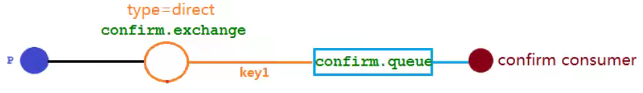
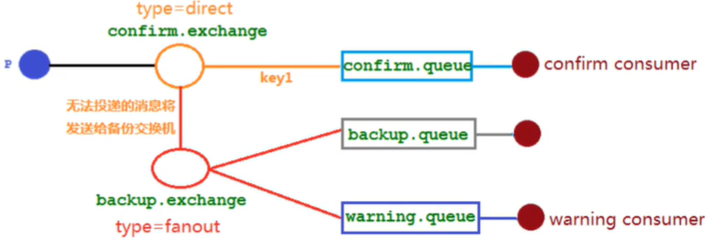

# 发布确认高级

在生产环境中由于一些不明原因，导致 RabbitMQ 重启，在 RabbitMQ 重启期间生产者消息投递失败，导致消息丢失，需要手动处理和恢复。于是，我们开始思考，如何才能进行 RabbitMQ 的消息可靠投递呢？特别是在这样比较极端的情况，RabbitMQ 集群不可用的时候，无法投递的消息该如何处理呢

##发布确认Spring Boot版本

### 代码结构图



### 配置文件

在配置文件`application.properties`中需要添加

```xml
spring.rabbitmq.publisher-confirm-type=correlated
```

- none：禁用发布确认模式，是默认值
- correlated：类似异步确认发布，发布消息成功到交换机后会触发回调方法
- simple：类似单独确认发布

### 声明交换机和队列

```java
@Configuration
public class ConfirmConfig {
	public static final String CONFIRM_EXCHANGE_NAME = "confirm_exchange";
	public static final String CONFIRM_QUEUE_NAME = "confirm_queue";
	public static final String CONFIRM_ROUTING_KEY = "key1";

	@Bean
	public DirectExchange confirmExchange() {
		return new DirectExchange(CONFIRM_EXCHANGE_NAME);
	}

	@Bean
	public Queue confirmQueue() {
		return QueueBuilder.durable(CONFIRM_QUEUE_NAME).build();
	}

	@Bean
	public Binding queueBindingExchange(@Qualifier("confirmExchange") DirectExchange confirmExchange,
	                                    @Qualifier("confirmQueue") Queue confirmQueue) {
		return BindingBuilder.bind(confirmQueue).to(confirmExchange).with(CONFIRM_ROUTING_KEY);
	}
}
```

### 生产者

```java
@Slf4j
@RestController
@RequestMapping("/confirm")
public class ProducerController {
	@Autowired
	private RabbitTemplate rabbitTemplate;

	@GetMapping("/sendMsg/{message}")
	public void sendMsg(@PathVariable String message) {
		CorrelationData correlationData1 = new CorrelationData("1");
		rabbitTemplate.convertAndSend(ConfirmConfig.CONFIRM_EXCHANGE_NAME, ConfirmConfig.CONFIRM_ROUTING_KEY, message + "1", correlationData1);
		log.info("发送消息内容：{}", message + "1");

		CorrelationData correlationData2 = new CorrelationData("2");
		rabbitTemplate.convertAndSend(ConfirmConfig.CONFIRM_EXCHANGE_NAME + "?", ConfirmConfig.CONFIRM_ROUTING_KEY, message + "2", correlationData2);
		log.info("发送消息内容：{}", message + "2");

		CorrelationData correlationData3 = new CorrelationData("3");
		rabbitTemplate.convertAndSend(ConfirmConfig.CONFIRM_EXCHANGE_NAME, ConfirmConfig.CONFIRM_ROUTING_KEY + "?", message + "3", correlationData3);
		log.info("发送消息内容：{}", message + "3");
	}
}
```

### 消费者

```java
@Slf4j
@Component
public class ConfirmConsumer {
	@RabbitListener(queues = ConfirmConfig.CONFIRM_QUEUE_NAME)
	public void receiveConfirmMessage(Message message) {
		String msg = new String(message.getBody());
		log.info("接收到队列confirm.queue消息：{}", msg);
	}
}
```

### 回调接口

```java
@Slf4j
@Component
public class ConfirmCallback implements RabbitTemplate.ConfirmCallback {
	@Autowired
	RabbitTemplate rabbitTemplate;

	@PostConstruct
	public void init() {
		//注入
		rabbitTemplate.setConfirmCallback(this);
	}

	/**
	 * 交换机确认回调接口
	 * 这个回调可以确认消息是否到达交换机
	 *
	 * @param correlationData 保存回调消息的id及相关信息
	 * @param ack             交换机是否收到消息
	 * @param cause           接收消息失败的原因
	 */
	@Override
	public void confirm(CorrelationData correlationData, boolean ack, String cause) {
		String id = correlationData != null ? correlationData.getId() : "null";
		if (ack) {
			log.info("交换机已经收到id为:{}的消息", id);
		} else {
			log.error("交换机未收到id为:{}的消息，原因:{}", id, cause);
		}
	}
}
```

### 结果分析

```java
发送消息内容：消息1
交换机已经收到id为:1的消息
接收到队列confirm.queue消息：消息1
发送消息内容：消息1
发送消息内容：消息1
Shutdown Signal: channel error; protocol method: #method<channel.close>(reply-code=404, reply-text=NOT_FOUND - no exchange 'confirm_exchange?' in vhost '/', class-id=60, method-id=40)
交换机已经收到id为:3的消息
交换机未收到id为:2的消息，原因:channel error; protocol method: #method<channel.close>(reply-code=404, reply-text=NOT_FOUND - no exchange 'confirm_exchange?' in vhost '/', class-id=60, method-id=40)
```

**调用生产者发送三个消息，第一个消息成功被处理。第二个消息因为交换机名称错误，成功被回调接口处理。第三个消息即使 routingKey 错误，但消息已经到达交换机，交换机便返回了 true 的 ack。**

## 回退消息

**在仅开启了生产者确认机制的情况下，交换机接收到消息后，会直接给消息生产者发送确认消息，如果发现该消息不可路由，那么消息会被直接丢弃，此时生产者是不知道消息被丢弃这个事件的。**那么如何让无法被路由的消息帮我想办法处理一下？最起码通知我一声，我好自己处理啊。

在原先不使用 Spring Boot 时，通过发布消息时`channel.basicPublish()`设置`mandatory`参数为`true`，并添加消息回退监听器`channel.addReturnListener()`，可以在当消息传递过程中不可达目的地时将消息返回给生产者。

Spring Boot 版本写法如下（或者`rabbitTemplate.setMandatory(true);`）：

### 配置文件

在配置文件`application.properties`中需要添加

```xml
spring.rabbitmq.publisher-returns=true
```

### 回调接口

实现`RabbitTemplate.ReturnsCallback`接口

```java
@Slf4j
@Component
public class ConfirmCallback implements RabbitTemplate.ConfirmCallback, RabbitTemplate.ReturnsCallback {
	@Autowired
	RabbitTemplate rabbitTemplate;

	@PostConstruct
	public void init() {
		//也可以通过这种方式替代 spring.rabbitmq.publisher-returns=true
//		rabbitTemplate.setMandatory(true);
		//注入
		rabbitTemplate.setConfirmCallback(this);
		rabbitTemplate.setReturnsCallback(this);
	}

	/**
	 * 交换机确认回调接口
	 * 这个回调可以确认消息是否到达交换机
	 *
	 * @param correlationData 保存回调消息的id及相关信息
	 * @param ack             交换机是否收到消息
	 * @param cause           接收消息失败的原因
	 */
	@Override
	public void confirm(CorrelationData correlationData, boolean ack, String cause) {
		String id = correlationData != null ? correlationData.getId() : "null";
		if (ack) {
			log.info("交换机已经收到id为:{}的消息", id);
		} else {
			log.error("交换机未收到id为:{}的消息，原因:{}", id, cause);
		}
	}

	/**
	 * 可以在当消息传递过程中不可达目的地时将消息返回给生产者，只有在消息不可达目的地的时候才进行回退
	 * 这个回调可以确认消息是否到达队列
	 *
	 * @param returned 回退的消息
	 */
	@Override
	public void returnedMessage(ReturnedMessage returned) {
		log.error("消息:{}，被交换机{}退回，原因:{}，路由Key:{}",
				new String(returned.getMessage().getBody()),
				returned.getExchange(),
				returned.getReplyText(),
				returned.getRoutingKey()
		);
	}
}
```

### 结果分析

**调用生产者发送三个消息，第一个消息成功被处理。第二个消息因为交换机名称错误，成功被交换机确认回调接口处理。第三个消息 routingKey 错误，但消息已经到达交换机，被交换机回退消息接口处理。**

Ps. 如果是基于插件的延迟交换机类型`x-delayed-message`，发送带延迟的消息，被交换机接收后，即使 routingKey 和队列都正确，**也会触发交换机回退消息接口**，但消息在延迟后**能够正常被消费者消费**。

## 备份交换机

有了 mandatory 参数和回退消息，我们获得了对无法投递消息的感知能力，有机会在生产者的消息无法被投递时发现并处理。但有时候，我们并不知道该如何处理这些无法路由的消息，最多打个日志，然后触发报警，再来手动处理。而通过日志来处理这些无法路由的消息是很不优雅的做法，特别是当生产者所在的服务有多台机器的时候，手动复制日志会更加麻烦而且容易出错。而且设置 mandatory 参数会增加生产者的复杂性，需要添加处理这些被退回的消息的逻辑。如果既不想丢失消息，又不想增加生产者的复杂性，该怎么做呢？前面在设置死信队列的文章中，我们提到，可以为队列设置死信交换机来存储那些处理失败的消息，可是这些不可路由消息根本没有机会进入到队列，因此无法使用死信队列来保存消息。在 RabbitMQ 中，有一种备份交换机的机制存在，可以很好的应对这个问题。什么是备份交换机呢？备份交换机可以理解为 RabbitMQ 中交换机的“备胎”，当我们为某一个交换机声明一个对应的备份交换机时，就是为它创建一个备胎，当交换机接收到一条不可路由消息时，将会把这条消息转发到备份交换机中，由备份交换机来进行转发和处理，通常备份交换机的类型为 Fanout，这样就能把所有消息都投递到与其绑定的队列中，然后我们在备份交换机下绑定一个队列，这样所有那些原交换机无法被路由的消息，就会都进入这个队列了。当然，我们还可以建立一个报警队列，用独立的消费者来进行监测和报警。

### 代码结构图



### 声明备份交换机和队列

```java
@Configuration
public class ConfirmConfig {
	public static final String CONFIRM_EXCHANGE_NAME = "confirm_exchange";
	public static final String CONFIRM_QUEUE_NAME = "confirm_queue";
	public static final String CONFIRM_ROUTING_KEY = "key1";

	//备份交换机
	public static final String BACKUP_EXCHANGE_NAME = "backup_exchange";
	//备份队列
	public static final String BACKUP_QUEUE_NAME = "backup_queue";
	//报警队列
	public static final String WARNING_QUEUE_NAME = "warning_queue";

	@Bean
	public Queue confirmQueue() {
		return QueueBuilder.durable(CONFIRM_QUEUE_NAME).build();
	}

	@Bean
	public DirectExchange confirmExchange() {
		return ExchangeBuilder.directExchange(CONFIRM_EXCHANGE_NAME).durable(true).withArgument("alternate-exchange", BACKUP_EXCHANGE_NAME).build();
	}

	@Bean
	public Binding queueBindingExchange(@Qualifier("confirmExchange") DirectExchange confirmExchange,
	                                    @Qualifier("confirmQueue") Queue confirmQueue) {
		return BindingBuilder.bind(confirmQueue).to(confirmExchange).with(CONFIRM_ROUTING_KEY);
	}

	//备份交换机
	@Bean
	public FanoutExchange backupExchange() {
		return new FanoutExchange(BACKUP_EXCHANGE_NAME);
	}

	@Bean
	public Queue backupQueue() {
		return QueueBuilder.durable(BACKUP_QUEUE_NAME).build();
	}

	@Bean
	public Queue warningQueue() {
		return QueueBuilder.durable(WARNING_QUEUE_NAME).build();
	}

	@Bean
	public Binding backupQueueBindingExchange(@Qualifier("backupExchange") FanoutExchange backupExchange,
	                                          @Qualifier("backupQueue") Queue backupQueue) {
		return BindingBuilder.bind(backupQueue).to(backupExchange);
	}

	@Bean
	public Binding warningQueueBindingExchange(@Qualifier("backupExchange") FanoutExchange backupExchange,
	                                           @Qualifier("warningQueue") Queue warningQueue) {
		return BindingBuilder.bind(warningQueue).to(backupExchange);
	}
}
```

### 结果分析

**调用生产者发送三个消息，第一个消息成功被处理。第二个消息因为交换机名称错误，成功被交换机确认回调接口处理。第三个消息 routingKey 错误，但消息已经到达交换机，被交换机放入设置的备份交换机，并且不触发交换机回退消息接口。**

回退消息和备份交换机，**备份交换机优先级更高**。

